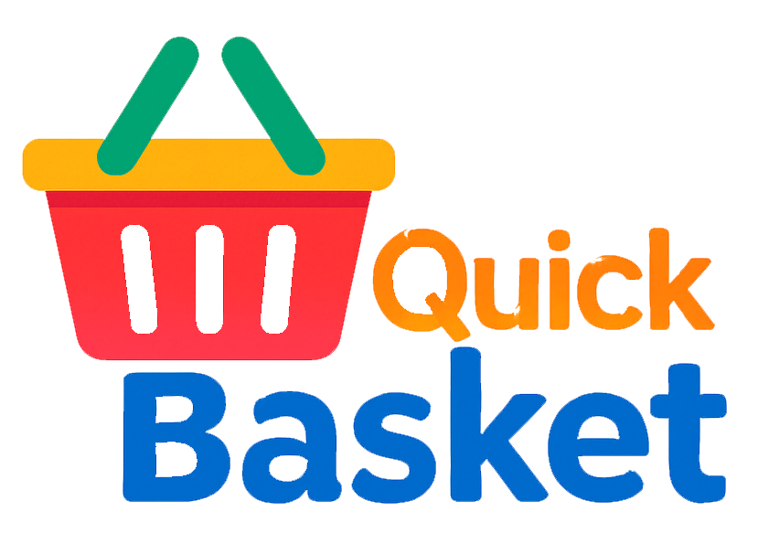

<p align="center">
  
</p>

#                                           QuickBasket Sales Analysis (SQL Project)

## 📊 Project Overview

**Project Title**: QuickBasket Sales Analysis\
**Skill Level**: Beginner\
**Database Name**: `Retail_sales_analysis`

This project simulates retail sales data for a fictional company called **QuickBasket**, created for educational and portfolio purposes. You'll perform data cleaning, exploration, and business analysis using SQL — skills essential for any aspiring data analyst.

---

## 🎯 Objectives

- 📂 **Database Setup**: Design and populate the sales database.
- 🧹 **Data Cleaning**: Remove null or incomplete entries.
- 🔍 **Exploratory Data Analysis (EDA)**: Explore customer behavior and sales trends.
- 💼 **Business Insights**: Use SQL to answer realistic business questions.

---

## 🗂️ Project Structure

### 1. 🔧 Database & Table Creation

```sql
CREATE DATABASE Retail_sales_analysis;

CREATE TABLE retail_sales(
      transactions_id INT PRIMARY KEY,
	  sale_date DATE,	
	  sale_time TIME,
	  customer_id INT,
	  gender VARCHAR(15),
	  age INT,
	  category VARCHAR(15),
	  quantity INT,
	  price_per_unit FLOAT,
	  cogs FLOAT,
	  total_sale FLOAT
);
```

---

### 2. 🧹 Data Cleaning & Exploration

- Count total records and unique values
- Identify and remove nulls

```sql
-- Total records
SELECT *
FROM retail_sales;
------------------Find Null data
SELECT * FROM retail_sales
WHERE sale_date IS NUll

SELECT * FROM retail_sales
WHERE
    sales_date IS NULL
	OR
	sale_time IS NULL
	OR
	customer_id IS NULL
	OR
	gender	age IS NULL
	OR
	category IS NULL
	OR
	quantiy IS NULL
	OR
	price_per_unit IS NULL
	OR
	cogs IS NULL
	OR
	total_sale IS NULL;

-----------------Delete the null data
DELETE * retail_sales
WHERE
	sale_time IS NULL
	OR
	customer_id IS NULL
	OR
	gender IS NULL
	OR
	age IS NULL
	OR
	category IS NULL
	OR
	quantity IS NULL
	OR
	price_per_unit IS NULL
	OR
	cogs IS NULL
	OR
	total_sale IS NULL;


```

---

### 3. 📊 Answering Queries

#### 1.How nany sales we have?

```sql
SELECT COUNT(*) as total_sale FROM retail_sales;
```
#### 2. How many customar we have?

```sql
SELECT COUNT(DISTINCT customer_id) FROM retail_sales;
```
#### 3. How many catagory we have?

```sql
SELECT DISTINCT category FROM retail_sales;
```


### 3. 📊 Business Queries And Answers

#### Q.1 Write a SQL query to retrieve all columns for sales made on '2022-11-05'

```sql
SELECT *
FROM retail_sales
WHERE sale_date='2022-11-05';
```

#### Q.2 Write a SQL query to retrieve all transactions where the category is 'Clothing' and the quantity sold is more than 4 in the month of Nov-2022

```sql
SELECT *
FROM retail_sales
WHERE
   category='Clothing'
   AND
   TO_CHAR(sale_date,'YYYY-MM')='2022-11'
   AND
   quantity>=4;
```

#### Q.3 Write a SQL query to calculate the total sales (total_sale) for each category.

```sql
SELECT
     category,
	 SUM(total_sale)AS net_sale,
	 COUNT(*)AS total_orders
FROM retail_sales
GROUP BY 1;
```

#### Q.4 Write a SQL query to find the average age of customers who purchased items from the 'Beauty' category.

```sql
SELECT ROUND(AVG(age),0)
FROM retail_sales
WHERE category='Beauty';
```

####  Q.5 Write a SQL query to find all transactions where the total_sale is greater than 1000.

```sql
SELECT *
FROM retail_sales
WHERE total_sale>1000;
```

#### Q.6 Write a SQL query to find the total number of transactions (transaction_id) made by each gender in each category.
```sql
SELECT
    category,
	gender,
	COUNT(*) AS total_transaction
FROM retail_sales
GROUP BY
    category,
	gender
ORDER BY
    category;
```

#### Q.7 Write a SQL query to calculate the average sale for each month. Find out best selling month in each year.

```sql
SELECT 
       	year,
       	month,
	avg_sale
FROM 
(    
SELECT 
    EXTRACT(YEAR FROM sale_date) as year,
    EXTRACT(MONTH FROM sale_date) as month,
    AVG(total_sale) as avg_sale,
    RANK() OVER(PARTITION BY EXTRACT(YEAR FROM sale_date) ORDER BY AVG(total_sale) DESC) as rank
FROM retail_sales
GROUP BY 1, 2
) as t1
WHERE rank = 1;
```

#### Q.8 Write a SQL query to find the top 5 customers based on the highest total sales

```sql
SELECT customer_id,
	SUM(total_sale) AS total_sales
FROM retail_sales
GROUP BY customer_id
ORDER BY total_sales DESC
LIMIT 5;
```

#### Q.9 Write a SQL query to find the number of unique customers who purchased items from each category.

```sql
SELECT 
	DISTINCT category,
	COUNT(DISTINCT customer_id)
FROM retail_sales
GROUP BY 1;
```

#### Q.10 Write a SQL query to create each shift and number of orders (Example Morning <=12, Afternoon Between 12 & 17, Evening >17)

```sql
WITH hourly_sale AS (
    SELECT *,
        CASE
            WHEN EXTRACT(HOUR FROM sale_time) < 12 THEN 'Morning'
            WHEN EXTRACT(HOUR FROM sale_time) BETWEEN 12 AND 17 THEN 'Afternoon'
            ELSE 'Evening'
        END AS shift
    FROM retail_sales
)
SELECT shift, COUNT(*) AS total_orders
FROM hourly_sale
GROUP BY shift;
```

---

## 📈 Key Insights

- **Peak Hours**: Most sales occurred during evening(After 7 pm).
- **Top Customers**: customer Id (34,142,11,45,36).
- **Category Trends**: Clothing (Total amount 698).
- **Sales Seasonality**: [April(Total sale 485)] was the top-performing month by average revenue.

---

## 🧪 How to Use This Project

1. **Clone the Repo**

   ```bash
   git clone https://github.com/dhananjoy01/quickbasket_sales_analysis.git
   ```

2. **Import the SQL File** Load `quickbasket_sales_analysis.sql` into your PostgreSQL or compatible database.

3. **Run the Queries** Use any SQL IDE (pgAdmin, DBeaver, MySQL Workbench, etc.) to execute and explore.

4. **Customize Further** Enhance the project by adding joins, window functions, or visual dashboards.

---

## 📌 Disclaimer

**QuickBasket** is a fictional company created solely for educational and demonstration purposes.\
Any resemblance to real entities is purely coincidental.

---

## 👨‍💼 Author: [Dhanan Joy](https://www.linkedin.com/in/dhananjoy01/)

This is part of my SQL portfolio to showcase practical skills in data analytics.

---

## 🌐 Connect with Me

- 💼 [LinkedIn](https://www.linkedin.com/in/najirr) – Let’s connect professionally
-	 [Gmail](dhananjoychandro01@gmail.com) – Let’s connect professionally
-    [Portfolio] (https://www.datascienceportfol.io/dhananjoychandro01)
-    [Kaggle]    (https://www.kaggle.com/dhanamjoy01/)

---

**Thanks for checking out this project! ⭐ Star the repo if you found it helpful.**

